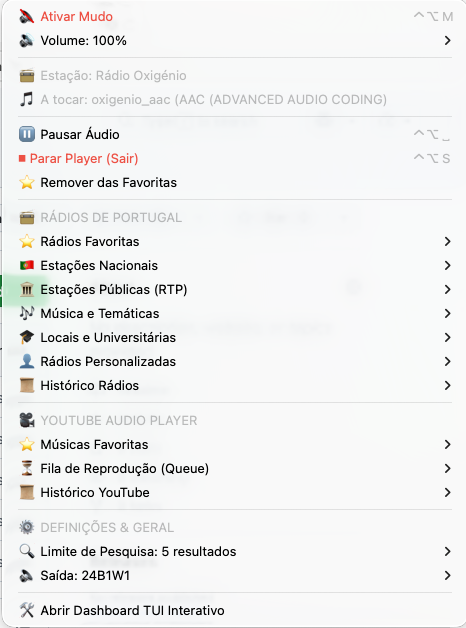

# 📻 Media Hub (Rádio & YouTube)

> O derradeiro reprodutor de Rádios Portuguesas e Áudio do YouTube para macOS. Leve, rápido e controlado em background (via `mpv` IPC).

O **Media Hub** junta o melhor de dois mundos: uma barra de menus do macOS interativa e discreta com o **SwiftBar**, e um painel de controlo completo em tempo real diretamente no teu Terminal (**TUI Dashboard**).

<p align="center">
  
</p>

---

## ✨ Características Principais

*   ⚡ **Leve & Rápido**: Consumo mínimo de CPU e RAM, sem necessidade de janelas de browser abertas.
*   📻 **+35 Rádios Portuguesas**: Curadoria integrada com as melhores rádios nacionais, temáticas e locais (Batida FM, M80, RFM, Antena 1/2/3, etc.).
*   🎥 **YouTube Integrado**: Pesquisa de músicas e playlists diretamente na barra de menus, com gestão de favoritos e fila de reprodução (Queue).
*   🔈 **Gestão de Áudio**: Controlos rápidos de mudo, alteração rápida de volume e seleção do dispositivo de saída de áudio física (ex: AirPods, Colunas Mac).
*   ⌨️ **Controlo Total**: Atalhos de teclado globais no macOS e atalhos rápidos interativos na TUI.

---

## 🎹 Atalhos & Comandos Rápidos (macOS / Terminal)

| Ação | 🚀 Atalho Global macOS (SwiftBar) | 💻 Tecla no Dashboard (TUI) |
| :--- | :---: | :---: |
| **Reproduzir / Pausar** | `Ctrl` + `Option` + `Space` | `[Espaço]` |
| **Ativar / Desativar Mudo** | `Ctrl` + `Option` + `M` | `[M]` |
| **Parar Player (Sair)** | `Ctrl` + `Option` + `S` | `[S]` |
| **Aumentar Volume (+10%)** | `Ctrl` + `Option` + `↑` | - |
| **Diminuir Volume (-10%)** | `Ctrl` + `Option` + `↓` | - |
| **Próxima Faixa (YouTube)** | `Ctrl` + `Option` + `→` | `[N]` |
| **Faixa Anterior (YouTube)** | `Ctrl` + `Option` + `←` | `[P]` |
| **Mudar de Separador (Tab)** | - | `[1]`, `[2]`, `[3]` |
| **Fechar TUI (Dashboard)** | - | `[Q]` |

### 📂 Atalhos Específicos do Dashboard (TUI)

#### **Separador [1] — Rádios**
*   `[Número]` (ex: `1`, `12`): Reproduz a rádio correspondente ao índice.
*   `[C]`: Cola e reproduz um URL do clipboard (ex: stream de rádio customizada).
*   `[A]`: Adiciona manualmente uma rádio (pede nome e URL).

#### **Separador [2] — YouTube**
*   `[C]`: Adiciona o URL de música/playlist do YouTube presente no clipboard.
*   `[A]`: Adiciona manualmente um link do YouTube.
*   `[T]`: Escolhe uma faixa da fila de reprodução (Queue) por índice.
*   `[H]`: Abre uma música/playlist a partir do histórico recente.
*   `[F]`: Adiciona a faixa atual à lista de Músicas Favoritas.
*   `[V]`: Reproduz a lista de Músicas Favoritas de forma sequencial.
*   `[X]`: Limpa totalmente a fila de reprodução (Queue).

#### **Separador [3] — Definições**
*   `[1-8]`: Seleciona o dispositivo físico de saída de áudio correspondente.
*   `[L]`: Configura o limite de resultados de pesquisa do YouTube (1 a 20).
*   `[R]`: Limpa o histórico de reprodução das Rádios.
*   `[Y]`: Limpa o histórico de reprodução do YouTube.
*   `[D]`: Remove todas as rádios personalizadas adicionadas por ti.
*   `[K]`: Limpa todo o histórico e cache guardados.

---

## 🛠️ Requisitos de Instalação (macOS)

O projeto requer que as seguintes dependências de sistema estejam instaladas via Homebrew:

```bash
# Instalar dependências de áudio e extrator
brew install mpv yt-dlp

# Instalar a aplicação de barra de menus SwiftBar
brew install --cask swiftbar
```

Não precisas de instalar bibliotecas adicionais de Python (`pip`), pois o script utiliza apenas os módulos nativos do sistema.

---

## 🚀 Instalação Rápida

1. Clona o repositório ou faz o download dos ficheiros.
2. Abre a pasta e corre o script de configuração automática:
   ```bash
   ./setup.sh
   ```
3. Copia/associa o ficheiro `media_player.5s.py` à pasta de plugins do teu SwiftBar.
4. Para abrir o Dashboard TUI em qualquer altura, corre:
   ```bash
   python3 media_player.5s.py
   ```

---

## 📊 Relatório de Consumos do Media Hub

### 1. 🧠 Memória RAM (Muito Baixo)

Motor do Player (Processo mpv): ~34.7 MB (Resident Set Size).
Nota: Graças à otimização no script que limita o buffer (--demuxer-max-bytes=5M), o consumo de memória RAM do leitor de áudio em background mantém-se estável à volta dos 30-35MB, mesmo a ouvir transmissões longas.
Script de Integração (media_player.5s.py): 0 MB em repouso. O SwiftBar executa o script a cada 5 segundos, este corre em cerca de ~40-50ms para atualizar o menu e termina imediatamente a sua execução, libertando toda a RAM.

### 2. ⚡ Processamento / CPU (Baixo)
A tocar Áudio (Rádio/YouTube): ~8% de uma única thread de CPU (num Mac com Apple Silicon).
Em Espera (Sem faixa ativa): 0.0% CPU. Quando o áudio é parado, o mpv entra em modo idle e não consome recursos de processamento.

### 3. 🌐 Tráfego de Rede / Internet
Como o player apenas descarrega a faixa de áudio e descarta o vídeo (graças ao argumento --no-video), o consumo é mínimo:

Streaming de Rádio Portuguesa: A maior parte das rádios transmite em AAC a 128 kbps ou 192 kbps.
~16 KB/s (a 128 kbps) ➔ Aprox. 57.6 MB por hora de reprodução.
~24 KB/s (a 192 kbps) ➔ Aprox. 86.4 MB por hora de reprodução.

Músicas do YouTube: É feito o stream do áudio M4A/OPUS otimizado (geralmente a 128-160 kbps).
~16 KB/s a 20 KB/s ➔ Aprox. 60 a 72 MB por hora.
Em Espera (Sem faixa ativa): 0 KB/s. Zero tráfego de rede.

🔌 Conexão Ativa no Momento
Ao analisar as ligações de rede do processo ativo do leitor (PID 14899), este está ligado a:

Servidor: proic1.redeaudio.com:https (Porta 443 - SSL seguro)
Protocolo: TCP (Estabelecido)
TIP

### Esta aplicação é extremamente leve e eficiente se comparada com abrir uma aba no browser (Chrome/Safari) para ouvir rádio ou YouTube, que facilmente consome entre 300 MB a 1 GB de RAM e até 15-20% de CPU devido ao processamento visual e anúncios.
